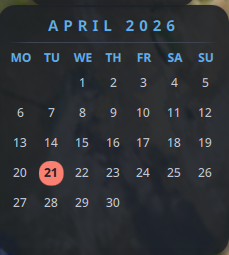

# Calendar Widget

A compact, theme aware Noctalia desktop widget that displays the current month.

## Features
- **Today highlight**
- **Sync with Noctalia's "First day of the week" configuration inside Region settings**
- **Resizing based on your need**

## Configuration
**Show Background**: able to toggle transparency background
**Rounded Corners**: able to toggle between Rounded or Squared corners

## Requirements
- **Noctalia Shell**: 4.5.0 or later.
- **Fonts**: Requires a monospace or icon-compatible font for proper alignment.

## Technical Details
- **Backend**: QML integration with shell-based data collection.
