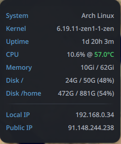

# Sys-Info Widget

A theme aware Noctalia desktop plugin that display system information.

## Features
Shows the running distribution, kernel and uptime, updated every minute.

## Configuration
None

## Requirements
- **Noctalia Shell**: 3.6.0 or later.
- **System Dependencies**:

## Technical Details
- **Data Source**: Polls standard system utilities.
- **Backend**: QML integration with shell-based data collection.
